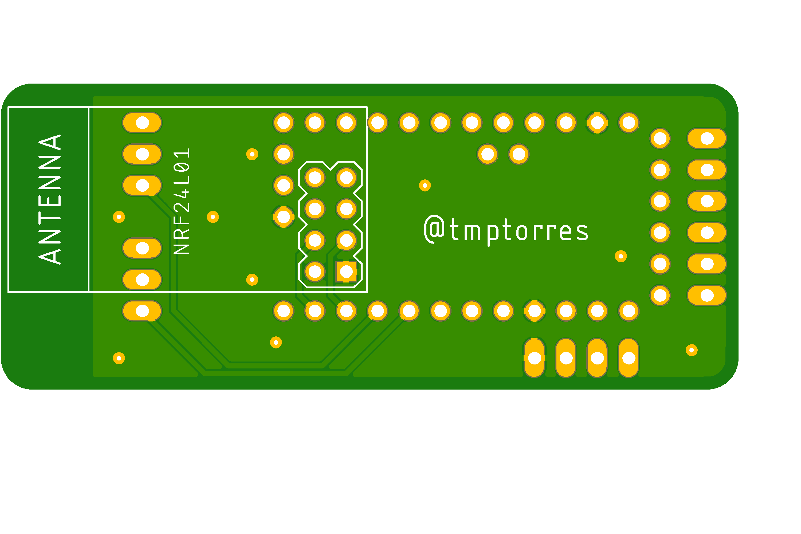

# Longboard-Remote-Reciever

A reciever board that uses an Arduino Nano and a 2.4GHz nRF24 WiFi module.
Has two dedicated outputs for PWM servo connections or boards recieving the signals.
5V power can be provided by either the PWM connections OR 3.3V power can be provided by the side connector.

## Product

## Top View

## Bottom View
